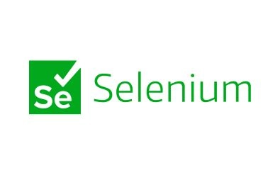

# Anaconda vs Python：选择数据科学工具，不用纠结那么多

---

想象一下，你准备开始搞机器学习、数据科学或者AI。工具得选对，但问题来了：Python和Anaconda，到底该用哪个?

其实这事儿没那么复杂。Python就像一把瑞士军刀——轻便、灵活、想怎么用就怎么用。但你得自己动手配置所有东西，装这个装那个，有时候还会遇到依赖冲突。

Anaconda呢?更像是精装修的房子，拎包入住那种。专门为数据科学打造，Jupyter Notebook、TensorFlow、Pandas这些工具全给你装好了，开箱即用。

所以选哪个?如果你喜欢自己折腾、追求极简配置，Python是你的菜。但如果你想要一个开箱即用的完整解决方案，👉 [Anaconda能让你省去大量配置时间，直接开始干活](https://www.scraperapi.com/?fp_ref=coupons)。

接下来我们聊聊这两个工具的区别、优势和适用场景，帮你做出适合自己的选择。

---

## Anaconda是什么?

Anaconda是Python(还有R)的一个开源发行版，专门服务于数据科学、AI和科学计算领域。

它预装了一堆常用库,还自带Conda包管理器和开发工具,比如Jupyter Notebook和Spyder。

对数据科学家来说，Anaconda最大的吸引力在于它能创建独立的工作环境，让你在不同项目之间切换时不用担心版本冲突。

Anaconda提供了超过7500个数据科学和机器学习包。这意味着你不用手动安装一堆依赖，省时省力，系统兼容性也更好。

## Anaconda的主要特点

Anaconda作为一个专注于数据科学、机器学习和AI的Python发行版，提供了一整套简化包管理、环境配置和依赖处理的解决方案。

### 1. 预装的数据科学库

Anaconda最大的优势就是预装了大量常用库：

- NumPy (数值计算)
- Pandas (数据处理)
- Matplotlib & Seaborn (数据可视化)
- Scikit-learn (机器学习)
- TensorFlow & Keras (深度学习)

这些库开箱即用，不用你自己下载配置，避免了兼容性问题，省了不少时间。

### 2. Conda包管理器

Anaconda自带的Conda包管理器比Python标准的pip好用多了：

- 自动处理依赖关系，减少库之间的冲突
- 可以在不同Python版本之间轻松切换
- 支持Python和非Python包(pip只支持Python包)

Conda让软件的安装和维护变得简单，特别是在需要很多库的项目中。

### 3. 环境管理

用Anaconda可以创建多个独立的环境，不同项目之间互不干扰。这在以下情况特别有用：

- 同时运行不同版本的Python
- 避免依赖冲突
- 轻松分享可复现的项目环境

比如你在做深度学习，一个项目用TensorFlow 2.0，另一个用TensorFlow 1.x，用Anaconda就能轻松搞定。

### 4. 集成开发环境(IDE)

Anaconda自带了几个好用的开发工具：

- **Jupyter Notebook** - 交互式编程环境，特别适合数据分析和可视化
- **Spyder** - 专为数据科学设计的IDE
- **RStudio** - 给用R语言的人准备的

当然，Anaconda也能和PyCharm、VS Code、Atom这些流行IDE配合使用，你可以在自己喜欢的环境里开发。

### 5. 跨平台支持

Anaconda在Windows、macOS和Linux上都能用，而且体验一致。这避免了在不同系统上运行Python代码时可能遇到的兼容性问题。

### 6. 机器学习和AI专属

Anaconda专门针对机器学习和深度学习优化，提供：

- 预装的TensorFlow、Keras、PyTorch等深度学习框架
- GPU加速包支持，缩短计算时间
- 与Dask等并行计算框架集成，处理大数据集时性能更好

## Anaconda集成了哪些工具?

Anaconda与众多数据科学和AI相关的工具和库无缝集成。以下是一些常见的集成工具：

### 1. Jupyter Notebook


- 在网页界面中编写和执行Python代码的交互式环境
- 支持内联数据可视化，特别适合探索性数据分析

### 2. Spyder


- 专门为科学计算和数据科学设计的Python IDE
- 类似MATLAB的界面，研究人员和工程师用起来很顺手

### 3. RStudio


- 统计计算和数据可视化领域广泛使用的R语言IDE
- 与Anaconda无缝集成，方便同时使用Python和R的用户

### 4. Dask


- 处理大数据的并行计算框架
- 可以在多个CPU核心甚至分布式系统上扩展数据科学计算

### 5. TensorFlow & PyTorch


- AI和ML领域使用最广泛的两个深度学习框架
- Anaconda提供预配置的GPU支持，高效运行深度学习模型

### 6. Scikit-learn


- 强大的机器学习库，包含分类、回归、聚类等算法
- 广泛用于训练和评估ML模型

### 7. XGBoost & LightGBM


- 用于构建高性能机器学习模型的梯度提升算法
- Kaggle竞赛和实际预测分析中的必备工具

这些集成工具让Anaconda成为数据科学、AI和机器学习的一站式环境，无需复杂的系统配置就能顺畅开发。

## Python是什么?

Python是一种通用编程语言，代码简洁、可读性强、灵活性高。它广泛应用于web开发、数据科学、自动化脚本、AI等领域。

Python的核心语言和Anaconda这种发行版不同。程序员需要用默认的包管理器pip手动安装包。虽然Python很灵活，但搭建数据科学环境确实比Anaconda麻烦一些。如果需要专业支持，可以考虑聘请有丰富经验的Python开发者。

## Python的特点和优势

Python是一种通用、高级的编程语言，拥有庞大的库生态系统和简单的语法。它在web开发、数据科学、AI和自动化等多个领域都有应用。Python软件开发方案充分利用这些优势，提供高效、可扩展的创新应用。

### 1. 易学易用

Python受欢迎的主要原因之一就是语法简单，接近英语。这让它成为以下人群的理想选择：

- 想开始学编程的初学者
- 快速应用开发，因为相比Java或C++等语言，Python需要的代码行数更少

比如，在Python中打印"Hello, World!"就是这么简单：

```python
print("Hello, World!")
```

这种简洁让开发者可以把更多精力放在解决问题上，而不是纠结语法。

### 2. 丰富的库支持

Python环境提供了大量库，支持各种功能：

- NumPy、Pandas、Matplotlib(数据分析和可视化)
- Scikit-learn、TensorFlow、PyTorch(机器学习和AI)
- Flask、Django(web开发)
- OpenCV(计算机视觉)
- Requests、BeautifulSoup(网页抓取)

这些预建的Python库让开发者不用从头写代码，提高了效率，减少了工作量。

### 3. 跨平台兼容性

Python在Windows、macOS和Linux上都能运行，代码不需要调整。这让Python成为以下场景的最佳选择：

- 需要在不同操作系统上运行的软件开发
- 需要执行后端程序的web平台应用

### 4. 支持面向对象和函数式编程

Python同时支持面向对象编程(OOP)和函数式编程(FP)，让开发者可以选择最适合的编程范式。

- OOP通过类和对象实现代码重用和模块化
- FP通过高阶函数、lambda函数和列表推导式实现声明式编程

### 5. 庞大活跃的社区

Python拥有最大的编程社区之一：

- 开发者可以在Stack Overflow、GitHub和Reddit等论坛快速找到解决方案
- Python社区持续更新，保持语言的现代性
- 全球Python开发者的广泛支持让它成为开发者的首选

### 6. 可扩展性和性能

Python能高效处理大型应用需求。

虽然Python比C++或Java慢，但可以通过优化提升性能：

- 使用Cython将Python代码编译为C来提升性能
- Numba是优化Python数值计算的工具

### 7. 自动化和脚本编写

Python广泛用于自动化重复任务，比如：

- 网页抓取(使用BeautifulSoup和Scrapy)
- 自动化文件操作(使用os和shutil模块)
- 编写系统管理脚本

Python的脚本功能减少了各行各业的手动工作。

### 8. 与其他语言和技术集成

Python可以无缝集成：

- C和C++(通过Cython和SWIG)
- Java(通过Jython)
- .NET(通过IronPython)
- Hadoop和Apache Spark等大数据技术

这让Python成为多语言项目的灵活选择。

## Python集成了哪些工具?

为Python构建的几个工具和框架让它在多个领域都能发挥作用：

### 1. Jupyter Notebook


- 开发者常用的交互式平台，用于数据科学和机器学习
- 支持markdown格式、可视化和交互组件

### 2. PyCharm


- JetBrains公司维护的功能强大的Python IDE
- 提供代码建议、调试功能和版本控制系统连接

### 3. VS Code


- 轻量级开源IDE，有强大的Python扩展
- 提供代码补全、语法高亮和内置调试工具

### 4. Flask & Django


- Flask是用于开发小型web应用的微框架
- Django是用于创建可扩展web应用的高级完整框架，内置安全功能

### 5. TensorFlow & PyTorch


- TensorFlow是构建AI系统的深度学习框架
- PyTorch是具有动态计算图的灵活机器学习框架

### 6. Selenium



- Web自动化领域的重要开发和测试工具
- 主要用于浏览器控制自动化和web应用测试

### 7. OpenCV


- 管理图像和视频处理的计算机视觉库
- 支持人脸识别、物体检测和增强现实等应用

### 8. Apache Spark


- 允许大规模分布式处理的大数据平台
- Python通过PySpark与Spark兼容，实现数据工程功能

Python通过这些集成功能，在web应用、机器学习和自动化操作等方面提供了多样化的开发能力。

## 机器学习场景：Anaconda vs Python

说到机器学习，Anaconda往往更受欢迎，因为它预装了Scikit-learn、TensorFlow和PyTorch等ML库。它自带Conda，比pip更好地管理依赖，还有Jupyter Notebook，方便测试和可视化模型。Anaconda还支持隔离环境，防止版本冲突，并通过内置CUDA兼容性简化GPU支持。

不过，如果你喜欢轻量级、灵活的配置，标准Python配合pip也是不错的选择。虽然需要手动安装库，但能更好地控制依赖。

标准Python在生产环境中广泛使用，与云平台集成良好，使用Flask或FastAPI等框架部署ML模型时更高效。

## Anaconda vs Python：核心区别

| 特性 | Python | Anaconda |
|------|--------|----------|
| 类型 | 编程语言 | Python发行版 |
| 安装大小 | 轻量(约50MB) | 较大(约3-5GB) |
| 包管理 | pip | Conda |
| 预装库 | 需手动安装 | 7500+预装包 |
| 环境管理 | venv | Conda环境 |
| 最适合 | 通用开发 | 数据科学/ML |
| IDE | 需单独安装 | 自带Jupyter、Spyder |
| 学习曲线 | 适中 | 初学者友好 |

## 何时使用Python或Anaconda(哪个更好?)

### 选择Anaconda的情况：

- 你是初学者，想要简单的ML配置
- 需要预装的TensorFlow、PyTorch、Scikit-learn等库
- 经常使用Jupyter Notebook进行交互式ML模型开发
- 想要用Conda轻松管理环境
- 从事数据科学、AI研究或学术项目

### 选择标准Python的情况：

- 需要轻量级灵活的配置
- 将ML模型部署到生产环境
- 习惯用pip手动管理依赖
- 从事端到端AI应用(不只是研究)
- 使用Docker或云平台进行部署

---

## 总结

Python和Anaconda各有用途。Python是一种灵活的编程语言，可用于各种应用；Anaconda是Python的专业发行版，让数据科学和机器学习变得更简单。

如果你是开发通用应用的程序员，选Python。如果你是数据科学家或ML工程师，👉 [Anaconda能在管理依赖和环境方面为你节省大量时间](https://www.scraperapi.com/?fp_ref=coupons)。

## 常见问题

### 1. 可以不用Anaconda只用Python吗?

可以，Python可以独立安装使用，用pip管理包。

### 2. 可以同时安装Anaconda和Python吗?

可以，但要注意环境管理，避免冲突。

### 3. Anaconda比Python慢吗?

Anaconda体积较大，所以加载环境可能比轻量级Python安装慢一些。

### 4. Anaconda免费吗?

对个人用户免费，但有带高级功能的企业版本。

### 5. 专业数据科学家用Anaconda吗?

是的，很多专业人士因为Anaconda易用而将其用于机器学习、数据分析和AI。
